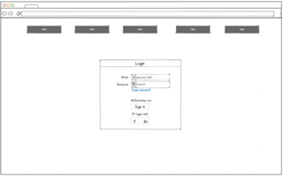

# CS260 Startup Project

## Specification

### Elevator Pitch:

- I am going to make a trivia game website. There will be different triva question packs that have themes.

### Key Features:

- There wil be a login screen and high scores screen and the main part will be cards with questions and buttons to choose your answer.

### Technologies:

- I will use these technologies in the following ways:

- **HTML** - For the structure of the website
- **CSS** - To style the buttons, cards, and other elements
- **JavaScript** - This will be the gears working in the background to fun the appropriate functions to run the game
- **Service** - This will manage the and the requests and data going in and out for the various function calls
- **DB** - This will store the information for login credentials, trivia questions, high scores etc...
- **Login** - To register users and securely store their credentials
- **WebSocket** - Shows new high scores as they come in
- **React** - Ported to the react web framework

## HMTL Deliverable

- I created the html to provide the general structure for my web application
- I provided placdholders for all the necessary technologies/functions

## CSS Deliverable

- I added basic styling to my .html pages
- The buttons, menus, etc.. have been styled

## JavaScript Deliverable

//TODO

## Service Deliverable

//TODO

## DB Deliverable

//TODO

## Login Deliverable

//TODO

## WebSocket Deliverable

//TODO

## React Deliverable

//TODO
